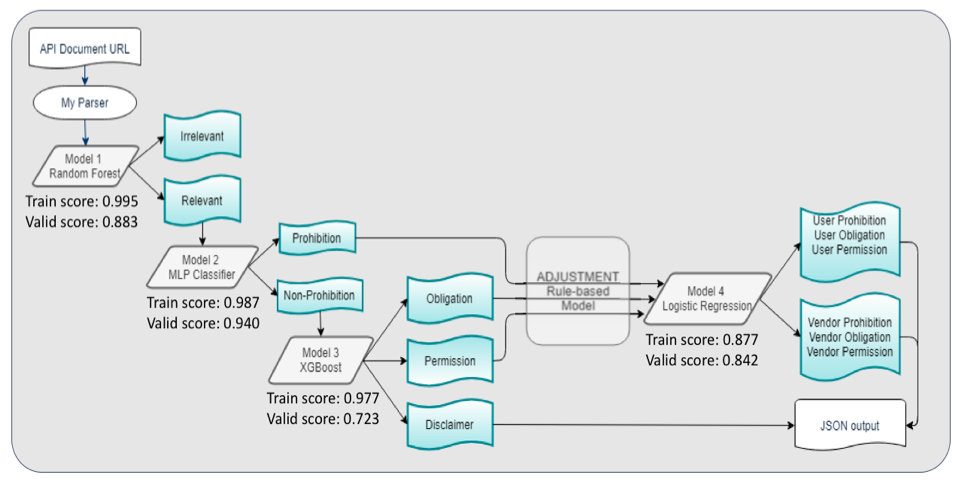

Executive Summary
TeejLab is a SaaS platform that provide API service to software developers and legal team. The API Discovery tool helps users explore a variety of API services and its terms and conditions. Our task is to improve the accuracy and user experience of the API analyzers. Through problem identification, data acquisition, feature and model selection, evaluation and UI/UX redesign, we are able to improve the overall F1 score from 0.407 to 0.604 and enhance the user interface.

Introduction
The core value that the agreement analyzer brings to TeejLab customers is to capture, classify and highlight meaningful statements from lengthy legal documents. TeejLab previously used a linguistic rule-based approach for this task. Depending on modal keywords and negation appearance, sentences would be categorized into Permission, Prohibition, Obligation and Unidentified. The downside of this approach is that it is fragile and does not work if the text does not contain one of the few keywords in the list. Consequently, this approach missed many important legal liabilities and led to higher risk of terms and conditions violation. Some other problems identified with the previous analyze includes: (1) dual meaning sentence extractions; (2) unclear pronouns such as “it”; and (3) user experience improvement. Our goal was to develop a robust classification solution that classifies sentences into legal clauses (Permission, Prohibition and Obligation, Disclaimer) and identifies its addressed party (Customer, Vendor). 
We were given 26 labelled sentences in a CSV file along with the source code of TeejLab’s previous rule-based model. Over the course of the following 5 weeks, we received 1,787 more labeled sentences by lawyers and industry professionals. 
We confronted two major challenges at the start of the project. Firstly, insufficient labelled data restricted us from attempting any supervised learning techniques. Secondly, lack of an evaluation framework made it difficult to assess the performance of existing and new models. Therefore, we distilled the client’s needs into three scientific objectives.

1.	Establish an evaluation framework that highlights recall and precision to tackle false negatives and false positives, respectively.
2.	Improve the accuracy and robustness of the analyzer by developing a hybrid hierarchical model leveraging supervised learning and linguistic features.
3.	Improve the user interface by identifying any new relevant categories and the user experience by modifying the highlighting rules.

Data Science Method
After thorough experimentation with linguistic, supervised, and unsupervised models. We decided to ensemble a linguistic and supervised machine learning methodology that achieves the best performance.

Crowdsourcing Data Annotation
Lawyers annotated legal documents proved to be very time-consuming and costly. Alternatively, we utilized a crowdsourcing annotation platform, Figure Eight, to annotate 1,368 sentences. To ensure quality, we instituted controls such as minimum 70% correctness on test questions; minimum 70% agreement with dynamic judgement; and contributors restricted to English-speaking countries. The entire annotation task cost $231.81 (2₵ / judgment) and took around 20 hours to complete (Appendix I). Combined with lawyers-labelled data, our entire data set consisted of 2,999 labelled statements, which were split into 60% train, 20% validation and 20% test set.

Classification
We primarily used the supervised learning for classification, as it showed significant improvement in recall score over other approaches, but overfitting was observed in some models even after hyperparameter tuning. Howeve the rule-based model performed better on the precision score and can be more intuitively interpreted. Lastly, unsupervised learning models did not perform well, and lack interpretability. (Appendix II)

Components involved in constructing classification pipeline:
1.	HTML Metadata Parser: We enhanced the online text parser by incorporating extraction of hidden HTML features into a dataframe. The intuition was that the metadata is informative of the sentence category. For instance, titles with fewer number of words and tagged as headers tended to be irrelevant (Appendix III, Figure 11). The final parser engineers 27 features related to the linguistic and web-based properties of the sentence. Technology used: BeautifulSoup, NLTK, spaCy

2.	Model Selection: We tuned the hyperparameters using Randomized Search Cross Validation on various supervised learning models. These models were then evaluated with F-beta score, which weighted recall vs. precision differently depending on the model’s position in the classification pipeline. The model with the highest F-beta score was chosen. Technology used: scikit-learn

3.	Feature Engineering: A pipeline was constructed to identify the optimal vectorization method and the best features. Similar to model selection, the best sentence vectorizer was selected with the highest F-beta score. Then, features from the 27 metadata features were added via forward selection method. Technology used: scikit-learn, NLTK, spaCy

4.	Pipeline: A hierarchical pipeline with different classifiers and features to optimize results is used to classify statements. This tackles two important issues, (1) imbalanced data resulting in rare occurring classes and (2) prioritizing precision and recall at different stages of classification.
Data Product & Results
The data science methodologies lead to the creation of this project’s data product that we will be delivering to TeejLab. This data product comprises of three parts:
1.	Model tuning script
2.	Hybrid classification pipeline
3.	User experience

Model-tuning Script:
The model-tuning script is an end-to-end script that allows TeejLab to retrain the supervised learning classification models if or when more training data is available. In the process of building these models, we have trained and evaluated the performance of the models on terms & conditions and privacy documents from a wide variety or organizations. But the fact of the matter is that regulation and innovation in APIs could present unseen types of document which would require the solution to be continually retrained on up-to-date labelled data.

Hybrid Classification pipeline:
The hybrid classification pipeline is, based on our research, the optimal classification methodology to accurately classify relevant sentences into meaningful categories. It mimics a waterfall in the manner in which it classifies sentences into the appropriate categories.

Figure 1: Hybrid Classification Pipeline

The rationale behind this model is as follows:
1.	Relevant vs. Irrelevant: These groups of sentences tend to differ from one another significantly based on the vocabulary, metadata and meaning. Hence, they are easily distinguishable. In terms of the evaluation at this stage, a F-Beta score calculated with higher weightage on Recall of relevant sentences to reduce False Negatives.
2.	Prohibition and Non-Prohibition: The presence of negation in a sentence is easily distinguishable resulting in high accuracy in this classification. The evaluation metric at this stage emphasizes precision.
3.	Obligation, Permission and Disclaimer: The remaining term types are classified at this stage since the vocabulary of these sentences tends to be very similar. The emphasis is again on precision to ensure the statements are labeled correctly.
4.	Rule-based adjustment: The previous agreement analyzer’s strength in precisely labeling statements was a major advantage and we decided to incorporate that into our classification methodology by relabeling the more obvious statements into the correct term types.
5.	Party classification: Lastly, the party is predicted for permission, prohibition and obligation statements. A combination and precision and recall, F1-score, are used to evaluate this model.

Evaluation
Table 1. Model Accuracy Comparison
Approach
Precision
Recall
F1-score
Baseline Rule
0.461
0.494
0.407
Enhanced Supervised
0.639
0.614
0.608
Enhanced Hybrid
0.657
0.639
0.640
The test is on Google API Terms and Service.  The precision, recall, and F1-score are the overall result of the documents. The performances on each term-type are further broken down.

Figure 2: Model Accuracy Comparison by Term Type
Speed
There were some concerns on the scraping time used from TeejLab’s side as there is no database stores the documents. Hybrid model uses less time than the linguistic model but needs more time for the classification as four models need to be implemented sequentially.
Table 2. Model Speed Comparison
Step / time (s)
Linguistic Rule-based
Enhance Hybrid
Scrap, preprocess
0.59
0.29
Classification
1.66
2.61

User Experience
The advent of disclaimer category, as stated in the footnote, required modifying the user interface. We introduce a separate section at the bottom to list this category since it doesn’t directly align with either Vendor or User. Additionally, as a result of increasing recall, our analyzer is able to extract more sentences for each category. Specifying a fixed height for each section with a scrollbar would allow the content to appear on one screen. Using a scrollbar enables us to control the length of the content and provide a better user experience, but on the other hand, the user has to scroll through a long list of statements. To tackle this challenge, we have improved the highlighting of important segments of the statements. The entity mentioned in the sentences, extracted through named-entity recognition, is bolded and the key verb is underlined. The rationale behind this highlighting is that it facilitates easy skimming of numerous statements based on entities of interest.

Figure 3: TeejLab’s previous user interface on GitLab Privacy Policy

Figure 4: TeejLab’s current user interface on GitLab Privacy Policy

Figure 5: New Highlight Rules

Recommendations
1.	Use BERT in future experiments: Our results only improved marginally when using BERT, but this state-of-the-art technique could potentially be more effective with a larger volume of labelled data. In addition, it has higher requirements on the training time and computational resources.
2.	Adopt crowdsourcing techniques for data annotation: The advantages of crowdsourcing include affordability and speed. However, a common risk is the quality compromise, we suggest additional test questions and stricter quality controls.
3.	Use F-beta score for evaluation: We chose F-beta score for its customizable weighted harmonic mean of precision and recall. This evaluation metric allows us to optimize on recall for the relevant class, while focusing on precision on the relevant subclasses.
4.	Collect users’ feedback to further improve the product and the UI/UX design: Due to the lack of user analytics, we are unable to incorporate feedback into product design. We have proposed a couple of design ideas but a more effective way to make such decisions would be to conduct A/B testing.
5.	Although the hybrid model achieved better performance in our research, we cannot be confident that it is significantly better from the pure supervised learning pipeline. Performing statistical tests on model performance is recommended in further research.
In conclusion, we are confident that our hierarchical classification pipeline improved the robustness and accuracy by addressed the problem of misclassification. Additionally, our improvements to the user interface and experience will allow users to consume relevant statements more efficiently.
